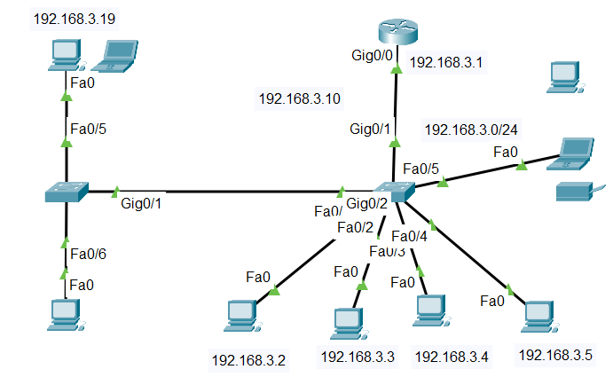

# Networking-Projects
This repository contains networking configurations, topologies, and documentation for various projects, including:

1. Multi-VLAN networks with router-on-a-stick and centralized DHCP.  
2. OSPF routing for multi-site communication with FTP/Web services.  
3. Static routing for WAN connectivity between sites.  
4. Port security configurations to enhance network security.

# Project Overview
  Multi-VLAN networks with router-on-a-stick and centralized DHCP.  
Description :
A simulated enterprise network with VLAN segmentation (HR, Sales, IT) and a router-on-a-stick for inter-VLAN routing. Includes a centralized DHCP server for dynamic IP assignment.
Details :

. VLANs for HR, Sales, and IT departments.
. Subinterfaces on the router for VLAN routing.
. DHCP server for automatic IP distribution.
  
