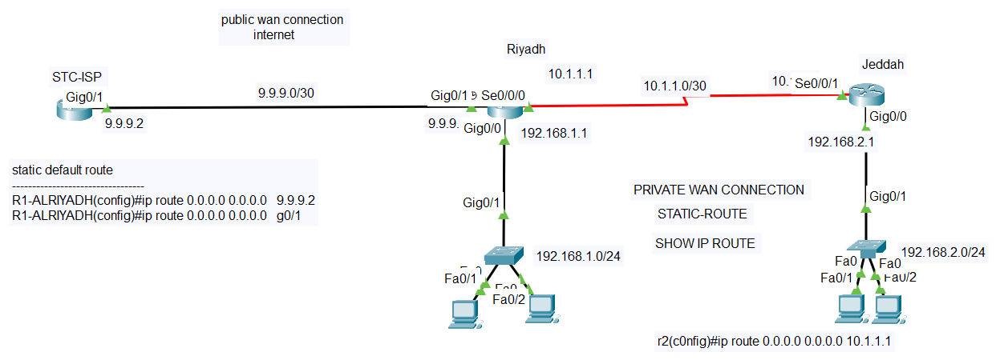
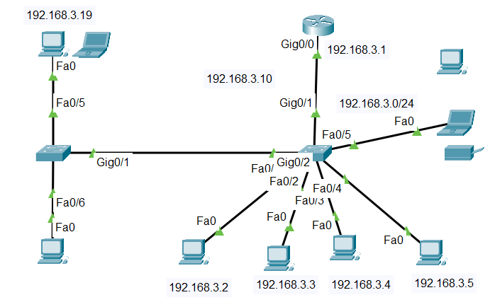

# Networking-Projects
This repository contains networking configurations, topologies, and documentation for various projects, including:

1. Multi-VLAN networks with router-on-a-stick and centralized DHCP.  
2. OSPF routing for multi-site communication with FTP/Web services.  
3. Static routing for WAN connectivity between sites.  
4. Port security configurations to enhance network security.

# Projects Overview
Multi-VLAN Network with Router-on-a-Stick and Centralized DHCP

## 📄 Description
A simulated enterprise network designed to segment traffic into different departments using VLANs. Implements **Router-on-a-Stick** for inter-VLAN routing and uses a **centralized DHCP server** for dynamic IP address assignment to end devices.

---

## 📋 Details

### 🧱 VLAN Structure
- 👥 **HR Department** – VLAN 10  
- 💼 **Sales Department** – VLAN 20  
- 🖥️ **IT Department** – VLAN 30
- 🖥️ **CiscoAdmin**    – VLAN 90
### 🚦 Router-on-a-Stick
- Configured subinterfaces on the router (`G0/1.10`, `G0/1.20`, `G0/1.30`, `G0/1.90`)
- Each subinterface corresponds to a VLAN and handles routing between them

### 🖧 Centralized DHCP Server
- Allocates IP addresses dynamically to all VLANs  
- Ensures simplified and centralized IP management  

### 🔀 Inter-VLAN Routing
- Enabled through trunk port between switch and router  
- All VLANs communicate securely and efficiently through router subinterfaces

  ### Multi-Router OSPF Network

## 📄 Description
An OSPF-configured network enabling seamless communication between multiple sites (Riyadh and Jeddah) with FTP/Web services and ACL-based security.

## 📋 Details
  - **OSPF Routing:** Dynamic path selection between sites using OSPF Area 0.
  - **FTP/Web Services:** Dedicated servers for file transfers and web access.
  - **ACL Security:** Restricts unauthorized traffic (e.g., blocking FTP access from specific hosts). Blocks traffic from restricted hosts (e.g., 172.16.1.2 to 172.16.2.5).
  - **Inter-Site Connectivity:** Reliable communication between Riyadh and Jeddah via serial links.
  - **Topology**
      

    # 🏢 Dual-Branch Enterprise Network with Static Routing and Internet Access

## 📄 Description
A simulated enterprise network connecting two branch offices (**Riyadh** and **Jeddah**) using a private WAN link and static routing. The **Riyadh** branch is connected to the internet via an ISP, while both sites have their own LAN segments.

---

## 📋 Details

### 🌐 Public WAN Link
- **Network:** `9.9.9.0/30`  
- **Purpose:** Connects Riyadh router to **STC-ISP**

### 🔒 Private WAN Connection
- **Network:** `10.1.1.0/30`  
- **Purpose:** Connects Riyadh and Jeddah routers using **serial interfaces**
  

  # 🔐 Port Security Configuration Lab

## 📄 Description  
This lab demonstrates how to secure switch ports using **Port Security** on Cisco switches. It includes configurations for a **single port** and a **range of ports**, with command verification using standard show commands.

---

## 📋 Details

### 🧪 Port Security on a Single Port  
- 🔌 **Switch**: SW-2  
- 🎯 **Port**: FastEthernet 0/5  
- 🛡️ **Security Settings**:
  - Mode: Access  
  - Max MAC: 1  
  - Static MAC Address 
  - Violation Mode: Shutdown

    

