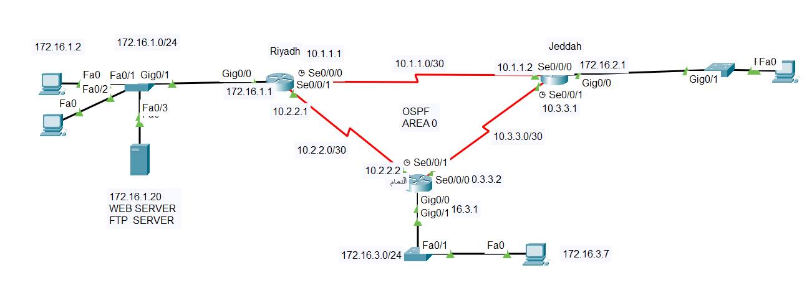

# Networking-Projects
This repository contains networking configurations, topologies, and documentation for various projects, including:

1. Multi-VLAN networks with router-on-a-stick and centralized DHCP.  
2. OSPF routing for multi-site communication with FTP/Web services.  
3. Static routing for WAN connectivity between sites.  
4. Port security configurations to enhance network security.

# Project Overview
### Multi-VLAN networks with router-on-a-stick and centralized DHCP.

## 📄 Description
A simulated enterprise network with VLAN segmentation (HR, Sales, IT) and a router-on-a-stick for inter-VLAN routing. Includes a centralized DHCP server for dynamic IP assignment. 
## 📋 Details
- VLANs for HR, Sales, and IT departments.
- Subinterfaces on the router for VLAN routing.
- DHCP server for automatic IP distribution.
- topology
  
  

  ### Multi-Router OSPF Network

## 📄 Description
An OSPF-configured network enabling seamless communication between multiple sites (Riyadh and Jeddah) with FTP/Web services and ACL-based security.

## 📋 Details
  - **OSPF Routing:** Dynamic path selection between sites using OSPF Area 0.
  - **FTP/Web Services:** Dedicated servers for file transfers and web access.
  - **ACL Security:** Restricts unauthorized traffic (e.g., blocking FTP access from specific hosts). Blocks traffic from restricted hosts (e.g., 172.16.1.2 to 172.16.2.5).
  - **Inter-Site Connectivity:** Reliable communication between Riyadh and Jeddah via serial links.
  - **Topology**
      
    # 🏢 Dual-Branch Enterprise Network with Static Routing and Internet Access

## 📄 Description
A simulated enterprise network connecting two branch offices (**Riyadh** and **Jeddah**) using a private WAN link and static routing. The **Riyadh** branch is connected to the internet via an ISP, while both sites have their own LAN segments.

---

## 📋 Details

### 🌐 Public WAN Link
- **Network:** `9.9.9.0/30`  
- **Purpose:** Connects Riyadh router to **STC-ISP**

### 🔒 Private WAN Connection
- **Network:** `10.1.1.0/30`  
- **Purpose:** Connects Riyadh and Jeddah routers using **serial interfaces**

